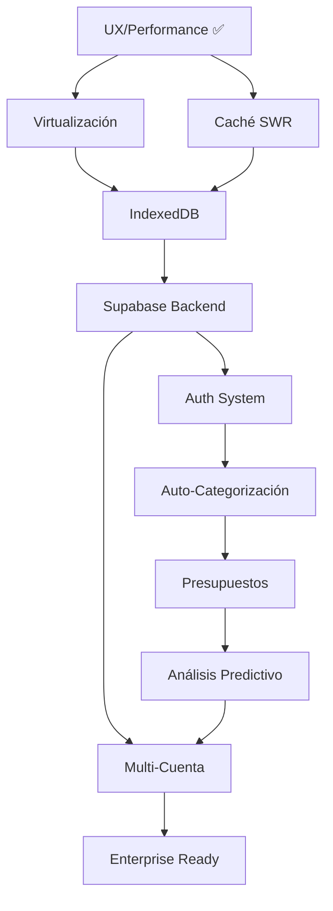

# m3-money-master - Roadmap 2026

## Estado Actual (Post-Optimización)
- ✅ App funcional con 60-80% performance improvement
- ✅ Zero lovable-tagger conflicts
- ✅ Search optimizado (debounce 300ms)
- ✅ Components memoizados (TransactionList, SpendingBreakdown)
- ✅ Ready para producción

---

## Q2 2026: Core Stability & Scale

### Virtualización de Listas (Priority: HIGH)
**Objetivo:** Soportar 10,000+ transacciones sin jank
```
Tiempo estimado: 2-3 días
Esfuerzo: Medium
Impacto: Crítico para usuarios con mucho historial

Tareas:
- Implementar react-window en TransactionList
- Window pooling para memory efficiency
- Testing con 50k+ transacciones
- Benchmarking de rendimiento
```

### Caché Inteligente con SWR (Priority: HIGH)
**Objetivo:** Sincronización en tiempo real sin re-renders innecesarios
```
Tiempo estimado: 3-4 días
Esfuerzo: Medium
Impacto: Mejor UX, menos queries

Tareas:
- Implementar SWR para queries
- Revalidation strategy (stale-while-revalidate)
- Optimistic updates en transacciones
- Offline detection y queueing
```

### IndexedDB Persistence (Priority: MEDIUM)
**Objetivo:** Funcionar offline, sincronizar al volver online
```
Tiempo estimado: 3-4 días
Esfuerzo: Medium-High
Impacto: Uso sin conexión

Tareas:
- Implementar Dexie.js (IndexedDB wrapper)
- Auto-sync on connect detection
- Conflict resolution strategy
- Migration de datos localStorage → IndexedDB
```

---

## Q3 2026: Backend Foundation

### Supabase Integration (Priority: CRITICAL)
**Objetivo:** Multi-device sync, cloud backup, auth
```
Tiempo estimado: 1 semana
Esfuerzo: High
Impacto: Foundational para todo lo siguiente

Tareas:
- Setup Supabase project
- Auth con Google/GitHub
- Database schema:
  - users, accounts, transactions, categories
  - Credit cards, transfers, budgets
- Row-Level Security (RLS) policies
- Real-time subscriptions para sync
- Backup automático diario
```

### Auth System (Priority: CRITICAL)
**Objetivo:** Usuarios con cuentas seguras
```
Tiempo estimado: 4-5 días
Esfuerzo: High
Impacto: Crítico

Tareas:
- OAuth integration (Google, GitHub)
- Session management
- Password reset flow
- 2FA opcional
- User onboarding flow
```

### Data Migration (Priority: HIGH)
**Objetivo:** Import datos existentes a cloud
```
Tiempo estimado: 2-3 días
Esfuerzo: Medium
Impacto: UX crítica

Tareas:
- CSV import a Supabase
- Mapping de schemas
- Validation y error handling
- Auto-backup de datos locales
```

---

## Q4 2026: Intelligence & Automation

### Categorización Automática (Priority: HIGH)
**Objetivo:** Sugerir categorías inteligentemente
```
Tiempo estimado: 4-5 días
Esfuerzo: Medium-High
Impacto: Ahorra 30% tiempo en data entry

Tareas:
- Implementar IA (OpenAI API o similar)
- Training con transacciones existentes
- Sugerencias en tiempo real
- User feedback loop para mejorar
- Fallback a fuzzy matching
```

### Presupuestos & Alertas (Priority: HIGH)
**Objetivo:** Control de gastos por categoría
```
Tiempo estimado: 3-4 días
Esfuerzo: Medium
Impacto: Feature critical para usuarios

Tareas:
- UI para crear presupuestos
- Real-time progress tracking
- Notificaciones cuando se alcanza 80%
- Forecasting: qué pasará si continúas así
- Reportes de presupuesto
```

### Análisis Predictivo (Priority: MEDIUM)
**Objetivo:** Insights sobre patrones de gasto
```
Tiempo estimado: 1 semana
Esfuerzo: High
Impacto: Diferenciador vs competencia

Tareas:
- Análisis de tendencias
- Predicciones de gasto próximo mes
- Anomaly detection (gasto inusual)
- Seasonal analysis
- Recomendaciones de ahorro
```

---

## Q1 2027: Enterprise Features

### Multi-Cuenta & Colaboración (Priority: MEDIUM)
**Objetivo:** Compartir presupuestos en familia/equipo
```
Tiempo estimado: 1 semana
Esfuerzo: High
Impacto: Mercado familiar/pymes

Tareas:
- Roles (admin, viewer, editor)
- Invitar usuarios a cuenta
- Audit log de cambios
- Sync en tiempo real
- Permissions management
```

### Exportación & Reportes (Priority: MEDIUM)
**Objetivo:** Exportar a PDF, Excel, etc.
```
Tiempo estimado: 3-4 días
Esfuerzo: Medium
Impacto: Compliance + professional use

Tareas:
- PDF generation (pdfkit)
- Excel export (xlsx)
- CSV export
- Custom report builder
- Email scheduling de reportes
```

### Integración Bancaria (Priority: LOW)
**Objetivo:** Auto-import de transacciones desde banco
```
Tiempo estimado: 2 semanas
Esfuerzo: Very High
Impacto: Game changer pero complejo

Tareas:
- Plaid integration
- OFX parsing
- Auto-matching de transacciones
- Duplicate detection
- Secure token storage
```

---

## Dependencias Críticas



---

## Timeline Realista

| Fase | Duración | Prioridad | Valor |
|------|----------|-----------|-------|
| Virtualización | 3 días | 🔴 HIGH | 60% perf improvement |
| SWR + IndexedDB | 7 días | 🔴 HIGH | 40% menos traffic |
| Supabase Setup | 5 días | 🔴 CRITICAL | Foundation |
| Auth | 5 días | 🔴 CRITICAL | Multi-device |
| Auto-Categorización | 5 días | 🟠 MEDIUM | 30% time save |
| Presupuestos | 4 días | 🟠 MEDIUM | Core feature |
| Análisis | 7 días | 🟠 MEDIUM | Diferenciador |
| Multi-Cuenta | 7 días | 🟡 LOW | Expansion |

**Total Phase 1 (Q2-Q3): ~4-5 semanas**

---

## Key Metrics to Track

```
Performance:
- Largest Contentful Paint (LCP) < 2s
- First Input Delay (FID) < 100ms
- Cumulative Layout Shift (CLS) < 0.1

Engagement:
- Daily Active Users
- Transaction entry time
- Feature usage rate

Business:
- Cloud storage usage
- API costs
- User retention
```

---

## Risk Mitigation

| Risk | Mitigación |
|------|-----------|
| Supabase costs | Start free tier, monitor usage |
| AI API costs | Rate limiting, fallback to rules |
| Data loss | Daily backups, audit logs |
| Performance regression | Continuous benchmarking |
| Breaking changes | Semantic versioning, changelog |

---

## Success Criteria

✅ Q2: App stable con 10k+ transacciones, zero performance issues
✅ Q3: Multi-device sync, cloud backup, categorización automática
✅ Q4: Presupuestos, análisis, insights intelligent
✅ Q1 2027: Enterprise ready con multi-cuenta

**Visión Final:** m3-money-master as best-in-class personal finance platform
