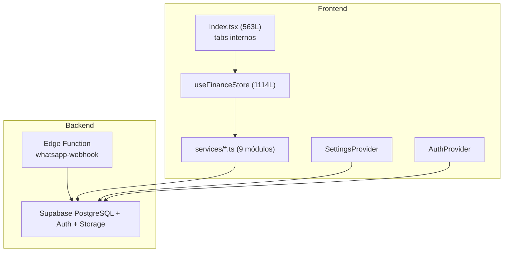

# Informe de auditoría — IMPERO (m3)

## 1. Qué es IMPERO y qué hace bien

**IMPERO** es una PWA de finanzas personales self-hosted sobre **React 18 + Supabase**. El posicionamiento es claro: soberanía de datos, ingesta de bajo fricción (CSV/Excel/PDF/WhatsApp), proyección de flujo de caja y gestión avanzada de tarjetas/cuotas. Para una app v0.1.0, el **alcance funcional es ambicioso y en gran parte real**.

### Fortalezas reales (no marketing)

| Área | Veredicto |
|------|-----------|
| **Modelo de dominio financiero** | Sólido: cuentas multi-moneda, tarjetas con ciclos/cuotas, transferencias, obligaciones, metas, presupuestos, reglas |
| **Seguridad de datos (RLS)** | Bien resuelto: todas las tablas con RLS, `(select auth.uid())`, funciones `SECURITY DEFINER` con `search_path` correcto |
| **Invariante de pasivos** | Correctamente aplicada en servicio: balances de crédito forzados a `<= 0` |
| **Parsers de importación** | CSV robusto (delimitadores, fechas AR, duplicados, cuotas). Tests dedicados |
| **Utilidades puras** | `cashflow-forecast`, `budget-utils`, `rules-engine`, `goal-utils` — testeadas y desacopladas |
| **Formato monetario es-AR** | Centralizado en `settings-store` con `formatAmount` / inputs bidireccionales |
| **Documentación de producto** | 21 specs + backlog priorizado — inusualmente maduro para un proyecto de este tamaño |
| **WhatsApp bot** | Edge Function funcional con parser heurístico + Gemini opcional; flujo de vinculación OTP en UI |
| **UX mobile** | Bottom nav, sheets responsivos, haptic feedback, PWA instalable, modo privacidad con atajo `H` |

En términos de **valor de producto**, IMPERO compite en features con Mobills/Wallet en varios ejes (tarjetas, importación, forecast, multi-moneda). La diferenciación soberana/WhatsApp es genuina, no cosmética.

---

## 2. Arquitectura técnica

### Diagrama simplificado del flujo actual



### Lo que está bien resuelto

1. **Capa de servicios desacoplada** — `accounts`, `transactions`, `planning`, `categories`, etc. CRUD limpio, sin lógica de UI mezclada.
2. **Optimistic updates** — En `addTransaction` hay rollback explícito si falla la inserción de cuotas (`finance-store.ts:188-197`). Patrón correcto para UX responsiva.
3. **Providers bien separados** — Auth, Settings, Privacy son Contexts acotados con responsabilidades claras.
4. **Schema consolidado** — Un solo archivo foundation para reset local; releases versionadas para prod. Buena práctica operativa.

### Lo que está mal resuelto (y va a doler escalar)

#### A. `useFinanceStore` es un anti-pattern crítico

```48:49:src/lib/finance-store.ts
export function useFinanceStore() {
  const { user } = useAuth();
```

**1114 líneas** mezclando: fetch, CRUD, cálculos derivados, side effects, métricas, procesamiento de recurrentes. El nombre sugiere singleton global, pero es un hook con `useState` local. Hoy funciona porque **solo lo invoca `Index.tsx`**, pero cualquier segundo caller tendría estado duplicado y desincronizado.

**Comparación con industria:** Copilot Money, Linear, Notion usan React Query/TanStack Query o stores globales (Zustand/Jotai) con cache invalidation. IMPERO tiene React Query **instalado y montado en `App.tsx`** pero con **cero `useQuery`/`useMutation`** en todo el codebase. Es dead weight arquitectónico.

**Recomendación:** Migrar a `FinanceProvider` (Context) o Zustand + React Query para server state. Prioridad **P0 técnica**.

#### B. SPA monolítica con "router falso"

`Index.tsx` orquesta ~15 módulos via `activeTab` string. No hay deep linking a `/reports`, `/budgets`, etc. El shortcut del manifest apunta a `/reports` pero **esa ruta no existe** en React Router.

**Comparación con industria:** Toda PWA financiera seria (YNAB, Copilot, Monarch) usa routing por feature con URLs compartibles y back button nativo. IMPERO pierde eso.

**Recomendación:** Rutas reales (`/dashboard`, `/transactions`, `/reports`, `/settings`) con tabs sincronizados a URL. Esfuerzo medio, impacto alto en UX y PWA.

#### C. God components

| Archivo | Líneas | Problema |
|---------|--------|----------|
| `finance-store.ts` | 1114 | Hook + store + business logic |
| `CreditCardManager.tsx` | 1047 | UI + dominio tarjetas + ciclos + cuotas |
| `CsvImportSheet.tsx` | 1017 | UI + preview + mapping + batch insert |
| `ObligationsManager.tsx` | 832 | Bills + recurrentes + estados |
| `QuickAddSheet.tsx` | 542 | Multi-step form + reglas + adjuntos |

**~5100 líneas** en 5 archivos. Mantenimiento, testing y onboarding de devs se vuelven costosos.

**Recomendación:** Extraer sub-componentes y hooks por dominio (`useCreditCardCycles`, `useCsvPreview`, `useObligations`). No es refactor cosmético: es prerequisito para testear UI.

---

## 3. Journeys / workflows funcionales

### 3.1 Autenticación y acceso

**Flujo:** Landing → `/auth` (login/signup gated por `VITE_ENABLE_SIGNUP`) → `/` protegido → reset password.

**Qué funciona:**
- Instancia privada bien pensada (signup deshabilitado por defecto)
- Errores humanizados (`auth-errors.ts`)
- Loading state en `ProtectedRoute`

**Qué no funciona / falta:**
- **OnboardingWizard existe pero nunca se monta** — grep confirma que solo aparece en su propio archivo. Un usuario nuevo cae al dashboard vacío sin guía.
- **Biometría WebAuthn documentada como "Completado" en backlog P12 pero no existe código** — ni `webauthn-guard.ts` ni `useBiometricLock.ts`. Solo modo privacidad (ofuscación).

**Veredicto:** Auth básica sólida. Onboarding y biometría son **deuda documentada como completada**.

---

### 3.2 Dashboard / Home

**Flujo:** Mes selector global → widgets configurables (`DashboardCardPicker`) → VelocityBar, BalanceHeader, AccountCards, NetWorthChart, presupuestos, metas, vencimientos, HealthScore.

**Qué funciona:**
- Personalización de secciones via settings
- Métricas reactivas al mes seleccionado
- Animaciones Framer Motion consistentes
- Atajo PWA `/?action=quick-add` funcional

**Qué no funciona:**
- `store.loading` existe pero **Index no muestra skeleton/spinner** durante carga inicial — flash de dashboard vacío
- Modo privacidad **no cubre todos los componentes** — solo ~6 archivos usan `maskAmount`/`usePrivacy`. `CreditCardManager` (1047L), `BudgetManager`, `GoalsManager`, `CashFlowForecast` exponen saldos sin enmascarar

---

### 3.3 Alta rápida (Quick Add)

**Flujo:** Monto → categoría/cuenta (smart chips) → detalles (cuotas, tags, nota, comprobante) → motor de reglas → insert optimista.

**Qué funciona:**
- Multi-step bien diseñado para mobile
- Haptic feedback (`navigator.vibrate`)
- Reglas aplicadas en `addTransaction`
- Adjuntos a Storage

**Comparación con industria:** Nivel Copilot Money / Monarch en fricción de registro manual. Bien resuelto.

**Mejora menor:** `triggerHaptic()` duplicado en 3+ componentes — extraer a util.

---

### 3.4 Importación CSV / Excel / PDF

**Flujo:** Settings o sidebar → sheet → upload → preview con mapping → deduplicación → batch insert → recálculo balances.

**Qué funciona:**
- CSV parser robusto con tests
- Excel via `xlsx`
- Inserción en lote eficiente
- Categorización predictiva

**Qué no funciona del todo:**
- PDF **solo BBVA Visa/Master** — otros bancos rechazados. El backlog marca P0 como "Completado" pero la cobertura real es parcial
- `CsvImportSheet.tsx` a 1017 líneas es difícil de extender para nuevos bancos

**Comparación con industria:** Mint/Plaid resuelven esto con agregadores bancarios. Para self-hosted, el parser manual es la única opción viable — pero hay que ser honestos sobre la cobertura limitada.

---

### 3.5 Tarjetas de crédito y cuotas

**Flujo:** CRUD tarjetas → ciclos de resumen → compras en cuotas → proyección futura → pago de resumen (`PayStatementModal`).

**Qué funciona:**
- Lógica de ciclos (`getStatementPeriod`, etc.) bien modelada
- Cuotas proyectadas en meses futuros
- Pago de resumen unificado (SPEC-017)
- Invariante balance `<= 0` garantizada

**Qué no funciona:**
- `credit_card_view_mode` referenciado en código (`accounts.service.ts:30`) pero **columna ausente en schema** — siempre cae al default `"statement_cycles"`
- `CreditCardManager` es un god component de 1047 líneas — difícil de mantener y testear

**Comparación con industria:** Este es el feature más diferenciador vs. apps genéricas. Mobills hace algo similar. IMPERO está en el mismo league funcional, pero la implementación necesita modularización.

---

### 3.6 Obligaciones / recurrentes / vencimientos

**Flujo:** Tab unificado `obligations` → bills (CRUD, marcar pagado → genera transacción) + recurrentes (auto-procesadas al cargar).

**Qué funciona:**
- Unificación bills + recurring bajo un tab
- `processRecurring()` auto-ejecutado post-carga
- Estados pending/overdue

**Qué no funciona:**
- Side effect automático al cargar (`Index.tsx:83-87`) puede sorprender al usuario si genera transacciones sin confirmación explícita
- 832 líneas en un solo componente

---

### 3.7 Presupuestos

**Flujo:** Límites por categoría/mes → alertas visuales de desvío → rollover opcional.

**Qué funciona:**
- UI de alertas y progreso visual
- Lógica de rollover en `budget-utils.ts` (testeada)

**Qué NO funciona (brecha crítica schema ↔ frontend):**

```10:19:src/services/planning.service.ts
export async function fetchBudgets(): Promise<Budget[]> {
  // ...
  return (data || []).map((b) => ({
    id: b.id,
    categoryId: b.category_id,
    amount: Number(b.amount),
    month: b.month,
    year: b.year,
    // enableRollover y accumulatedRollover NO se leen ni escriben
  }));
}
```

El UI setea `enableRollover`/`accumulatedRollover` en memoria, pero **no persisten en DB**. Al recargar, se pierden. Backlog P11 marcado "Completado" — **falso**.

---

### 3.8 Metas de ahorro

**Flujo:** CRUD metas → aportes/retiros generan transacciones reales → progreso visual.

**Qué funciona:** Bien implementado, persistido en Supabase, tests en `goal-utils`.

---

### 3.9 Cashflow forecast

**Flujo:** Embebido en Reports → proyección 30/60/90 días + simulador "¿puedo gastar $X?".

**Qué funciona:**
- Lógica pura testeada (`cashflow-forecast.test.ts`)
- Componente visual con Recharts

**Mejora:** Strings hardcodeadas en español fuera de i18n (`"Proyección de Flujo de Caja"`).

---

### 3.10 Reportes y exportación

**Flujo:** Tab reportes → gráficos Recharts → export CSV.

**Qué funciona:** Visualizaciones, tendencias, export básico.

**Comparación con industria:** Falta export PDF/Excel completo (SPEC-007 parcialmente cumplido).

---

### 3.11 WhatsApp bot

**Flujo:** Settings → vincular número → OTP 6 dígitos → enviar mensaje/audio/foto → Edge Function parsea → inserta transacción → confirmación.

**Qué funciona:**
- Edge Function con parser heurístico + Gemini
- Vinculación OTP con `crypto.getRandomValues`
- Tablas `whatsapp_integrations`, `whatsapp_messages`

**Riesgos de seguridad:**

```35:35:supabase/functions/whatsapp-webhook/index.ts
const expectedToken = Deno.env.get("WHATSAPP_VERIFY_TOKEN") || "m3_money_master_secret_webhook_token";
```

Token fallback hardcodeado — si no se configura en prod, cualquiera puede verificar el webhook.

```16:18:supabase/functions/whatsapp-webhook/index.ts
const corsHeaders = {
  "Access-Control-Allow-Origin": "*",
```

CORS abierto en Edge Function.

OTP almacenado en texto plano en DB (aceptable para verificación, pero no ideal).

---

### 3.12 Shopping lists

**Flujo:** Tab shopping → crear lista → agregar items → checkout genera transacción.

**Qué funciona:** UX de checkout a gasto real.

**Qué NO funciona (brecha crítica):**

```24:24:src/components/ShoppingListManager.tsx
const [lists, setLists] = useState<ShoppingList[]>([]);
```

Estado **100% en memoria**. Tablas `shopping_lists`/`shopping_list_items` existen en schema pero el frontend las ignora. Al recargar, **todo se pierde**. Backlog P18 marcado "Completado" — **falso para persistencia**.

---

### 3.13 Settings

**Flujo:** Idioma, moneda, cotizaciones, tema (claro/oscuro/sistema), 3 skins, privacidad, PWA install, import CSV, WhatsApp, logout.

**Qué funciona:** Sync con `user_settings` en Supabase + cache localStorage. Bien resuelto.

---

## 4. Base de datos y seguridad

### Fortalezas

- RLS en **todas** las tablas de usuario
- Triggers de seed automático al registrarse (`seed_user_defaults`)
- Storage bucket `receipts` con RLS por carpeta `user_id`
- `REVOKE` de funciones sensibles a anon/authenticated
- Índices en transactions por user/date, account, category

### Brechas schema ↔ app

| Feature en app | En schema DB | Estado |
|----------------|--------------|--------|
| `enableRollover`, `accumulatedRollover` | Ausente en `budgets` | **Roto** |
| `credit_card_view_mode` | Ausente en `accounts` | **Roto** |
| Shopping lists | Tablas existen | **Frontend no conectado** |
| `transaction_rules` | Tabla existe | Tipos Supabase desactualizados → `as any` |

### Tipos desactualizados

`integrations/supabase/types.ts` no incluye tablas post-v1.0. Resultado: **~30 `as any`** en services. Riesgo de bugs silenciosos en runtime.

**Recomendación:** Regenerar tipos con `supabase gen types typescript`. Prioridad **P1 técnica**.

---

## 5. Testing y calidad

```
16 archivos de test | 54 tests | todos pasan
```

| Área | Cobertura |
|------|-----------|
| Parsers (CSV, WhatsApp) | Buena |
| Utilidades financieras | Buena |
| finance-store | Mínima (4 tests) |
| Componentes UI | Mínima |
| Services Supabase | Ninguna |
| E2E Playwright | **Instalado, 0 specs** |

**Estimación:** ~15-20% del código de producción testeado significativamente. Sin reporte de coverage configurado.

**Comparación con industria:** Stripe, Linear, cualquier fintech seria exige >80% en lógica de dominio y E2E en flows críticos (auth, transacciones, importación). IMPERO está lejos de ese estándar.

**Recomendación:**
1. Tests de integración para services (mock Supabase)
2. E2E mínimo: login → quick add → ver transacción → import CSV
3. Coverage threshold en CI

---

## 6. PWA / Offline

### Implementado

- Manifest con shortcuts, iconos maskable
- SW manual con cache-first para shell, bypass para Supabase
- Registro solo en PROD
- Install prompt

### Limitaciones vs. claims del README

| Claim | Realidad |
|-------|----------|
| "Offline-first" | **Solo shell offline**. Datos financieros requieren red siempre |
| Shortcut `/reports` | **Roto** — no existe ruta |
| Branding IMPERO | SW cache name `m3-shell-v2`, keys `m3-transaction-rules`, `m3-privacy-mode` |

**Comparación con industria:** Copilot Money, YNAB usan IndexedDB + sync queue para mutaciones offline. IMPERO no tiene eso. El README oversell el offline.

**Recomendación:** Ajustar messaging a "PWA instalable con shell offline" o implementar sync queue real.

---

## 7. i18n

- `i18n.ts`: ~832 líneas, ~400+ keys × 2 idiomas (es/en)
- API tipada via `createTranslator(lang)`

**Problemas:**
- Strings hardcodeadas en español en varios componentes
- Duplicación semántica: `"nav.recurring"` y `"nav.obligations"` ambos = "Recurrentes"
- Backlog P13 "100% español" — parcialmente cierto

---

## 8. Documentación vs. realidad

El backlog marca **18 de 21 specs como "Completado"**. La realidad es más matizada:

| Spec | Backlog | Realidad |
|------|---------|----------|
| SPEC-003 CSV/PDF import | Completado | CSV/Excel sí; PDF solo BBVA |
| SPEC-013 Rollover | Completado | **UI sí, persistencia no** |
| SPEC-014 Biometría | Completado | **Solo privacidad, sin WebAuthn** |
| SPEC-009 PWA offline | Completado | Shell sí, datos no |
| SPEC-020 Shopping lists | Completado | **Checkout sí, persistencia no** |
| SPEC-021 Brand IMPERO | En progreso | Restos `m3` en SW, localStorage, scripts |
| Onboarding | — | **Componente huérfano** |

**Problema de gobernanza:** Marcar features como completadas cuando tienen brechas funcionales erosiona confianza en el backlog y dificulta priorización real.

---

## 9. Comparación con benchmarks de industria

| Dimensión | IMPERO | Mobills/Wallet | Copilot/YNAB | Veredicto |
|-----------|--------|----------------|--------------|-----------|
| **Registro manual** | QuickAdd 2.0 con chips | Similar | Similar | ✅ Paridad |
| **Importación bancaria** | CSV/Excel/PDF parcial | CSV + sync bancario | Plaid/agregadores | ⚠️ Limitado (esperable self-hosted) |
| **Tarjetas/cuotas** | Avanzado | Avanzado | Básico | ✅ Diferenciador |
| **Forecast** | 30/60/90 + simulador | Básico | Avanzado | ✅ Competitivo |
| **WhatsApp/IA** | Sí (Edge Function) | No | No | ✅ Diferenciador único |
| **Offline** | Shell only | Full sync | Full sync | ❌ Gap |
| **Biometría** | No | Sí | Sí | ❌ Gap |
| **Deep linking** | No | Sí | Sí | ❌ Gap |
| **Testing** | ~15-20% | N/A | >80% | ❌ Gap |
| **Arquitectura** | Monolito + god hook | N/A | Modular + RQ | ❌ Deuda técnica |

---

## 10. Recomendaciones priorizadas

### P0 — Bloqueantes de confianza

1. **Conectar shopping lists a Supabase** — tablas existen, falta service + wiring. Esfuerzo bajo, impacto alto en credibilidad del backlog.

2. **Persistir rollover en schema** — agregar columnas `enable_rollover`, `accumulated_rollover` a `budgets` + actualizar `planning.service.ts`.

3. **Montar OnboardingWizard** — componente listo, falta condicional en `Index.tsx` basado en `localStorage`/`user_settings`.

4. **Regenerar tipos Supabase** — eliminar `as any` en services.

### P1 — Deuda técnica que escala mal

5. **Extraer `FinanceProvider` o migrar a React Query** — el hook de 1114L no escala.

6. **Routing real por feature** — URLs compartibles, back button, shortcuts PWA funcionales.

7. **Modularizar god components** — empezar por `CreditCardManager` y `CsvImportSheet`.

8. **Loading states globales** — skeleton en Index durante `store.loading`.

### P2 — Calidad y seguridad

9. **Extender modo privacidad** a todos los componentes con montos.

10. **Eliminar token fallback hardcodeado** en WhatsApp webhook.

11. **Tests E2E mínimos** con Playwright (ya instalado).

12. **Ajustar backlog** — marcar specs como "Parcial" donde corresponda.

### P3 — Polish

13. **Completar i18n** — auditar strings hardcodeadas.

14. **Renombrar restos `m3`** → IMPERO en SW, localStorage keys, scripts.

15. **Implementar WebAuthn** o remover del backlog como completado.

16. **Remover React Query** si no se va a usar, o usarlo de verdad.

---

## 11. Veredicto final

**IMPERO es un producto funcionalmente ambicioso con diferenciadores reales** (WhatsApp, tarjetas/cuotas, forecast, soberanía). Para v0.1.0 self-hosted, el alcance de features es impresionante.

**Pero tiene tres problemas estructurales:**

1. **Arquitectura frágil** — un hook monolítico, god components, React Query muerto. Funciona hoy con un solo caller, pero no escala.

2. **Brechas schema ↔ frontend** — rollover, shopping lists, `credit_card_view_mode` documentados como completados pero no persisten. Esto es lo más grave: el usuario pierde datos al recargar.

3. **Backlog optimista** — 18/21 specs "Completados" cuando varios tienen gaps funcionales. Esto dificulta saber qué falta realmente.

**Comparado con Mobills/Wallet en features:** paridad o superior en tarjetas, importación manual, forecast. Inferior en offline, biometría, sync bancario automático (esperable).

**Comparado con Copilot/YNAB en arquitectura:** significativamente atrás en testing, modularidad, offline sync.

**Recomendación estratégica:** Antes de agregar features nuevas, cerrar las 4 brechas P0 (shopping lists, rollover, onboarding, tipos). Son de bajo esfuerzo y alto impacto en credibilidad. Luego, atacar la deuda del `finance-store` — es el cuello de botella para todo lo demás.
